# Multi-Layout UI Framework

A specialized React-based UI framework showcasing distinct design systems for diverse industry sectors. This repository contains high-fidelity templates for academic institutions, e-commerce platforms, logistics services, and professional portfolios, all built with a focus on modularity and responsive performance.

## Project Architecture

The project is structured to handle multiple UI ecosystems within a single repository. Each group (School, E-Commerce, Delivery, Portfolio) is isolated within its own layout and logic path to ensure scalability and clean separation of concerns.

### Core Technologies
* **React 18**: Component-based architecture.
* **Tailwind CSS**: Utility-first styling for high-performance UI.
* **React Router v6**: Manages complex nested routing for different sector groups.
* **Lucide React**: For consistent, lightweight iconography.

---

## UI Groups & Features

### 1. School System (UI)
A comprehensive educational interface featuring an editorial-style landing page and a gallery of five distinct login portal designs. 
* **Template Switching**: Real-time design toggling via a centralized hub.
* **Responsive Navigation**: Optimized floating navigation bar that adapts for mobile touch-targets and desktop precision.
* **State-Driven Transitions**: Simulated authentication flows using managed loading states.

### 2. E-Commerce
Clean, focused interfaces designed for retail efficiency.
* Minimalist login structures.
* Grid-based product presentation layouts.

### 3. Delivery & Logistics
High-contrast, functional UI intended for operational clarity and speed.

---

## 🖼️ Visual Documentation

### School Ecosystem: Desktop View
The following previews demonstrate the high-fidelity desktop experience, from the public landing page to the five specialized authentication portals.

| Component | Preview |
| :--- | :--- |
| **Landing Page** | 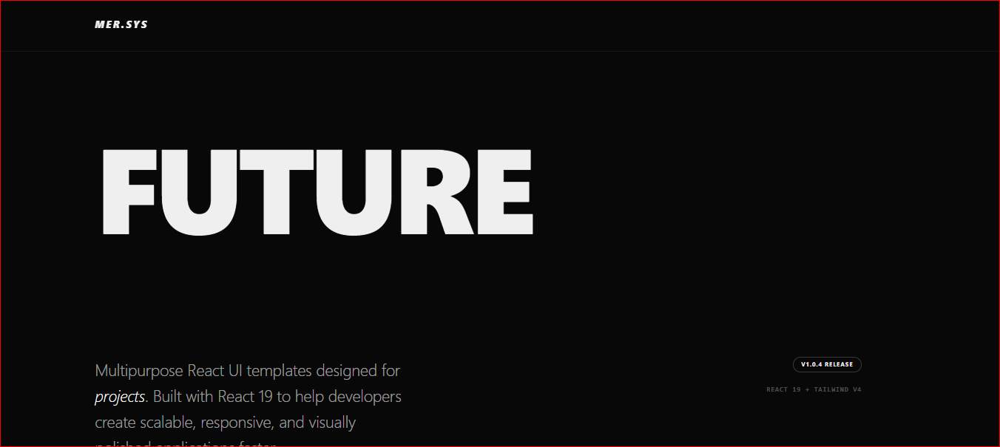 |
| **SchoolTemplate (1)** | 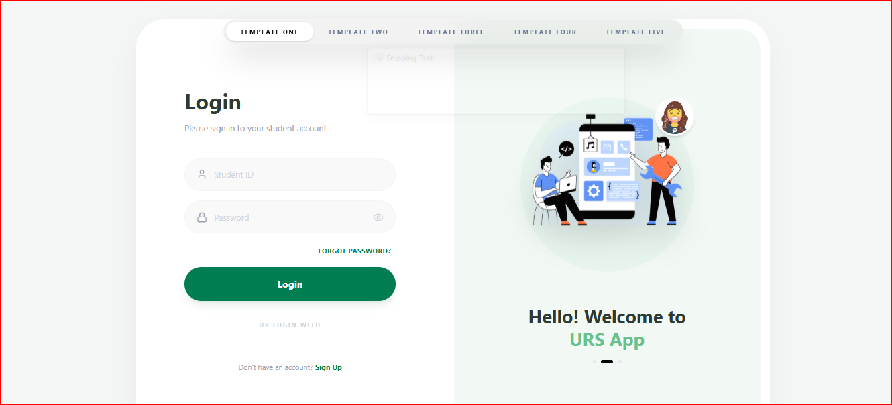 |
| **SchoolMidnight (2)** | 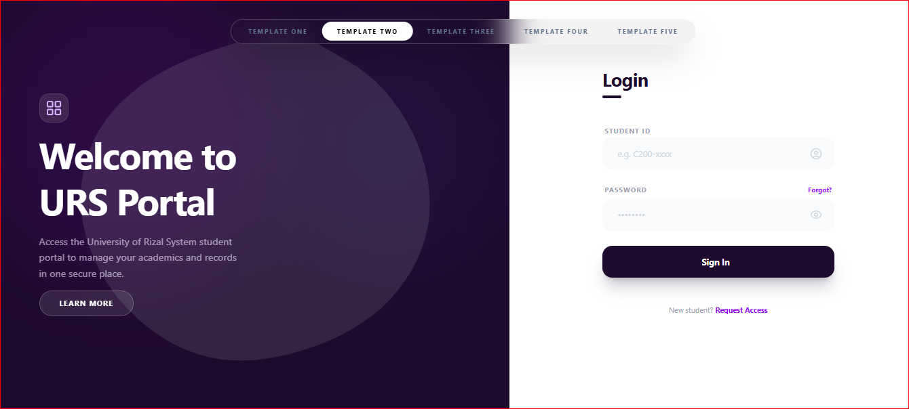 |
| **SchoolLoft (3)** | 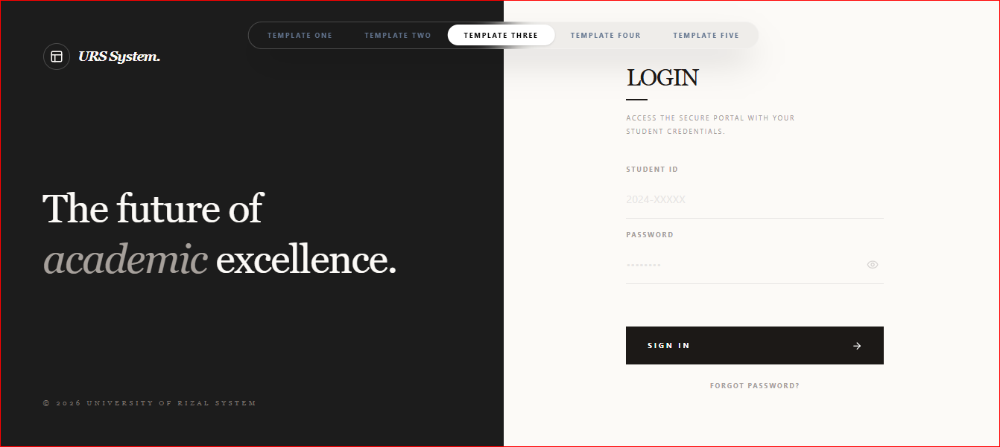 |
| **SchoolBlob (4)** | 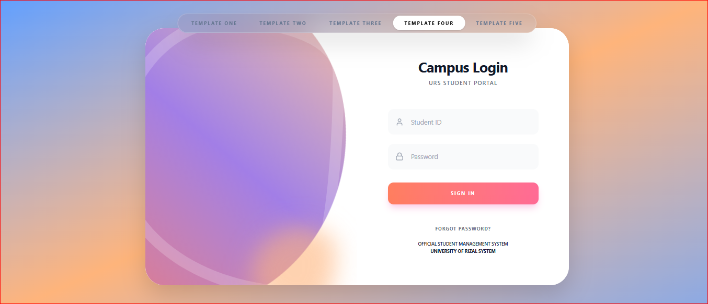 |
| **SchoolFix (5)** | 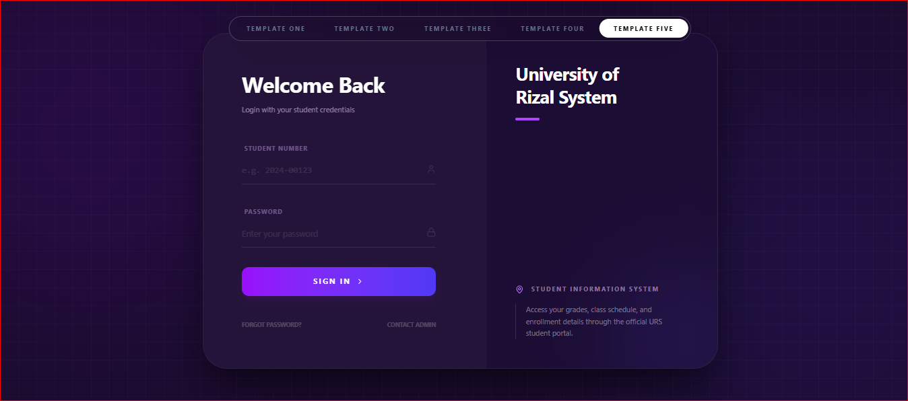 |


### ### Mobile Experience
Optimized for touch-targets and vertical flow, accessible via the `src/assets/screenshots/SchoolMobileview/` directory.

| Mobile Landing Page |
| :--- |
| 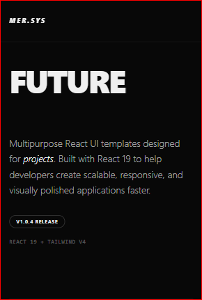 |

#### Mobile Login Variations
| mOne | mTwo | mThree | mFour | mFive |
| :---: | :---: | :---: | :---: | :---: |
| 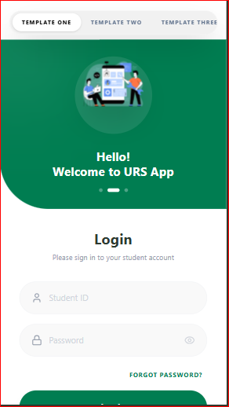 | 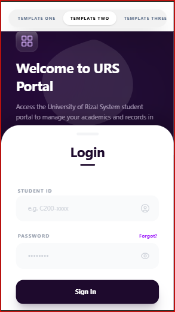 | 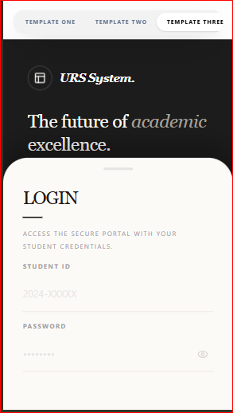 | 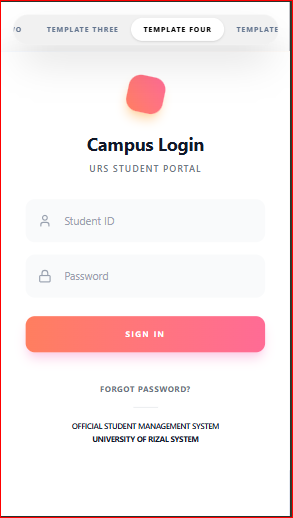 | 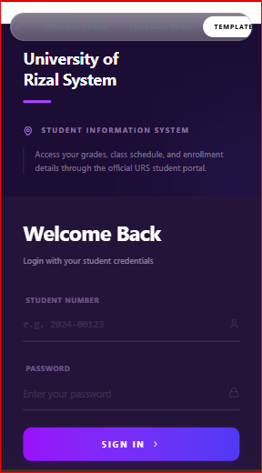 |

---


## Installation and Setup

1. **Clone the repository:**
   ```bash
   git clone [https://github.com/merlogic/Multi-Layout-UI-Framework.git](https://github.com/merlogic/Multi-Layout-UI-Framework.git)
2.  **Install dependencies:**
    ```bash
    npm install 
3. **Start the development server:**
    npm run dev

